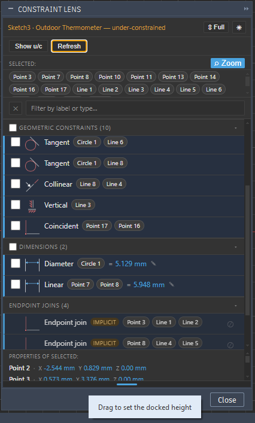

# ConstraintLens

A Fusion 360 add-in that docks a panel listing every sketch constraint and dimension — with click-to-select, delete, filter, and full diagnosis of over/under-constrained sketches.

Fills the long-standing UX gap of having to hunt tiny on-canvas glyphs to audit and repair a sketch.

<p align="center">
  
</p>

---

## Requirements

- Fusion 360 January 2026 release or later (Python 3.14 runtime).
- Windows or macOS.

---

## Installation

1. Download the latest `ConstraintLens-vX.Y.Z.zip` from [**Releases**](../../releases).
2. Extract so that you have a `ConstraintLens/` folder (not a nested `ConstraintLens/ConstraintLens/`).
3. Copy the `ConstraintLens/` folder into your Fusion add-ins directory:
   - **Windows:** `%APPDATA%\Autodesk\Autodesk Fusion 360\API\AddIns\`
   - **macOS:** `~/Library/Application Support/Autodesk/Autodesk Fusion 360/API/AddIns/`
4. In Fusion: **Utilities → Add-Ins → Scripts and Add-Ins** (or press `Shift+S`) → **Add-Ins** tab → select **ConstraintLens** → **Run**.
   - Tick **Run on Startup** to load it automatically on every Fusion launch.
   - Older Fusion versions put this under a **Tools** tab instead of **Utilities**. Same dialog, and `Shift+S` opens it either way.
5. The **Constraint Lens** button appears in the **Sketch → Constraints** panel (visible while editing a sketch).

---

## Quick start

1. Open a design and double-click a sketch in the browser tree to enter sketch-edit mode.
2. Click **Constraint Lens** in the Sketch toolbar. The palette appears immediately, docked on the right — no Refresh needed. Drag it anywhere you prefer, including back out to a floating window.
3. The palette lists every geometric constraint, dimension, and implicit endpoint join in the sketch.
4. Click any row to highlight the constraint's geometry in the viewport.

---

## The palette interface

```
┌──────────────────────────────────────────┐
│  Sketch3 (Body1) — under-constrained  ☀  │  ← name bar (theme toggle)
├──────────────────────────────────────────┤
│  [Clear] [Delete 0] [Show u/c] [Refresh] │  ← toolbar
├──────────────────────────────────────────┤
│  SELECTED:                            ⌕  │  ← canvas selection (auto, hidden when empty)
│   Line 3                                 │  ← entity chips (scrolls after 2 rows)
├──────────────────────────────────────────┤
│  [✕] Filter by label or type…            │  ← filter bar (✕ always clears filter)
├──────────────────────────────────────────┤
│  ☑ GEOMETRIC CONSTRAINTS (6)          ▾  │  ← collapsible section + select-all checkbox
│  [⊥] Perpendicular (Line 1)(Line 2)   □ │  ← type, then clickable entity chips
│  [∥] Parallel (Line 3)(Line 4)        □ │
│  …                                       │
│  ☑ DIMENSIONS (3)                     ▾  │
│  [◇] Linear (Line 1)(Line 3) = 40 mm ✎ □ │  ← value inline, ✎ always visible
│  …                                       │
│  ENDPOINT JOINS (4)                   ▾  │
│  [⊘] Endpoint join (Point 1)(Line 2)    │
├──────────────────────────────────────────┤
│  PROPERTIES OF SELECTED:                 │  ← properties footer (scrolls after 2 rows)
│  Line 3   Length 42.5 mm                 │
└──────────────────────────────────────────┘
```

### Sketch name bar (top row)

Shows the sketch name, parent component, and constrained state:
- **Green** — fully constrained.
- **Yellow/orange** — under-constrained (some geometry is still free).
- **Red** — over-constrained or has errors.
- Any `healthState` warning message is shown inline.

One toggle button sits on the right end of the name bar:

| Button | What it does |
|---|---|
| **☀ / 🌙** (theme toggle) | Switches between dark (default) and light theme. Preference is saved in `localStorage` and restored when the palette is reopened. |
| **⇕ 50% / 75% / Full** (height cycle) | Cycles the docked height between half, three-quarters and the full dock column. The choice is saved in `localStorage` and re-applied the next time the palette is docked. |
| **?** (tips) | Opens a cheat sheet of everything the palette can do, in the palette itself — most of it is an unlabelled click target. Dismiss with **Esc**, the **✕**, or by clicking outside the sheet. |

> **Docking** is handled by Fusion itself. Drag the palette title bar to any edge of the Fusion window to snap-dock it (right / left / bottom / top), or drop it anywhere to float.
>
> **The palette opens docked to the right**, next to where Fusion's own Sketch Palette sits. Fusion does *not* remember a custom palette's position across sessions — left alone it creates one floating at screen coordinates (0, 0), which on a multi-monitor setup can be the corner of a different monitor than the one Fusion is on, making the palette look as though it never opened (issue #11). Docking it on creation puts it inside the Fusion window by construction. Move it wherever you like afterwards; the choice holds for the rest of the session, including across the automatic hide/show, and resets when Fusion restarts.
>
> **Height when docked** is handled by ConstraintLens, because Fusion does not give a docked custom palette a bottom drag handle of its own. Use the **⇕** button for the three presets, or drag the grip strip along the very bottom edge of the panel for any height in between. Width, and both dimensions while floating, are Fusion's own drag handles as usual.
>
> **The two panes inside the palette resize too.** A grip strip sits under the **Selected:** chip row and above the **Properties of selected:** footer — drag either one to give that pane more room, and **double-click it to reset** to the default. Both sizes are saved in `localStorage` and restored on the next launch. Neither pane can take more than 60% of the palette, so the constraint list always keeps its share.

### Toolbar (buttons row)

| Button | What it does |
|---|---|
| **Clear** | Deselects all checked rows (visible only when rows are checked). |
| **Delete N** | Deletes all checked rows at once after a confirmation prompt (visible only when rows are checked). |
| **Show u/c** | Calls Fusion's built-in Show Underconstrained command. Under-constrained entities are surfaced as clickable chips in the "Selected:" strip. Requires an active sketch edit context. |
| **Refresh** | Manually re-scans the active sketch. Usually not needed — the palette refreshes automatically after every sketch edit. |
> **The palette follows sketch-edit mode.** It hides when you leave a sketch — it has nothing to show outside one — and comes back automatically on the next sketch you edit, so you only have to open it once per Fusion session.
>
> **To stop it reappearing**, close it with the **✕**. It then stays away until you click **Constraint Lens** in the Sketch toolbar again.
>
> Your dock position, size and collapsed state are preserved across the hide/show, because the palette object is reused rather than recreated — ConstraintLens never changes them once it is up. (Across a Fusion *restart* the palette is created afresh and opens docked right again, as above.)

### Selected section (canvas → palette, automatic)

Appears automatically above the filter bar whenever you select anything on the canvas. No button click required — the palette listens to Fusion's `activeSelectionChanged` event.

- Shows the selected entity or entities as clickable chips (e.g. `Line 3`, `Circle 1`). The strip scrolls after two rows of chips.
- Every row in the list that references any selected entity is highlighted with a blue left border and scrolled into view.
- **When exactly one entity is selected**, the filter bar is automatically set to that entity's label, narrowing the list to every constraint involving it. Selecting multiple entities leaves the filter unchanged.
- Clicking a chip sets the filter bar to that entity's label and selects it on the canvas.
- The section hides itself when nothing is selected.

The **⌕ Zoom** button at the right end of the "Selected:" header controls **auto-zoom**:
- **Off (default):** camera stays where it is.
- **On:** each selection repositions the camera so the selected geometry fills the viewport (bounding-box fit with 1.5× padding). Useful for locating tiny construction lines.
- Preference is persisted in `localStorage` and restored on palette reopen.

When **Show u/c** is triggered, the section header changes to "Underconstrained:" and shows chips for all under-constrained entities instead of the generic canvas selection.

### Row layout and the full description

A dimension row reads as a single line — icon, type, entity chips, then `=` and
the editable value with an always-visible **✎**:

```
[◇] Linear  (Line 1) (Line 3)  = 40 mm ✎
```

Click **✎** (or double-click the row) to edit the value in place; Enter commits,
Esc cancels.

Each row shows the constraint **type** followed by its entities as clickable
chips. The entity names are deliberately not repeated as prose next to the type —
the chips already carry them, and they are the useful copy since clicking one
filters the list and selects the entity on the canvas.

**Hover the type name** to see the full description and the underlying Fusion API
type, e.g. `Tangent — Line 3 ⌒ Arc 1` and `TangentConstraint`. Both remain
searchable in the filter bar even though only the type is shown on the row.

### Filter bar

The **✕** button on the left always clears the filter instantly. Type any text in the search field to narrow the list — matches against constraint labels, constraint type names, and entity chip labels (e.g. type `"Line 3"` to find every constraint that involves Line 3). The section headers update to show `(N of M)` when a filter is active.

The filter is also set **automatically** when you click a single entity on the canvas — the palette immediately narrows to constraints that involve that entity. Click ✕ or clear the field manually to restore the full list.

### Properties of selected footer

A footer at the bottom of the palette shows the name and key measured properties of the currently selected entity — useful when the palette is docked over Fusion's own bottom-right status corner. Updates immediately on every selection change; hides itself when nothing is selected.

**Drag the grip strip directly above it to make it taller** when several entities are selected, and **double-click that strip to reset** it to the default height. The size is remembered between sessions.

| Entity type | Properties shown |
|---|---|
| Sketch line / B-Rep edge | `Length` |
| Sketch circle | `Radius`, `Diameter` |
| Sketch arc | `Radius`, `Sweep` angle |
| Sketch ellipse | `Major`, `Minor` axis radii |
| Sketch point | `X`, `Y`, `Z` coordinates (sketch space — Z is meaningful in a 3D sketch) |
| Sketch dimension | `Name` (the parameter identifier, e.g. `d526`) and current `Value` (expression) |
| B-Rep face | `Area` |
| B-Rep body | `Volume`, `Area` |
| Profile | `Area` |

**Select exactly two entities** and a derived measurement appears as the first row
of the footer, labelled `Line 3 ↔ Arc 1`:

| Selection | Shown |
|---|---|
| Any two entities | `Distance` — the minimum distance between them |
| Two lines | `Angle` as well as `Distance` (for parallel lines the angle is 0° and the distance is the useful figure) |
| Two circles | `Distance` is the gap between circumferences; for concentric circles that equals the radial offset |
| A point and a line | `Distance` measured to the line, handled correctly for a finite segment |

These come from Fusion's own measurement engine (`MeasureManager`), so the values
match what the built-in **Measure** tool reports rather than being calculated
separately.

---

## Interactions

### Click a row → select entities in viewport

Clicking anywhere on a row selects all geometry that the constraint references in the Fusion viewport. The canvas highlights the selected entities. Click again or use Fusion's **Escape** to deselect.

### Click the constraint icon → select the constraint object itself

Each row has a type icon on the left (e.g. the Parallel glyph, the Perpendicular glyph). **Clicking the icon** selects the constraint object itself — not just its referenced geometry. This lets you use Fusion's native **Delete** key as an alternative way to remove a constraint.

> This is different from clicking the row body: clicking the row selects geometry; clicking the icon selects the constraint.

### Hover for tooltips

Hover over any button or row element to see a tooltip explaining what it does. Icon glyphs show the constraint type name on hover.

### Double-click a row → open Fusion's edit dialog

Double-clicking a row opens the native Fusion edit dialog for that constraint or dimension:
- **Dimensions** (Linear, Angular, Radial, Diameter, etc.) — opens the standard dimension editor so you can change the value.
- **Offset curves dimension** — opens the Offset Curves edit dialog.
- **Circular / Rectangular pattern** — opens the corresponding pattern edit dialog.

Geometric constraints (Parallel, Perpendicular, etc.) do not have an edit dialog in Fusion — double-click does nothing for those rows.

### Inline edit a dimension expression (pencil icon)

Every dimension row shows its expression value in accent color (e.g. `40 mm`). **Hover** over the expression to reveal a pencil (✎) icon. **Click the pencil** to open an inline text field directly in the palette:
- Type a new expression (e.g. `50 mm` or a parameter name like `width`).
- Press **Enter** to commit. The sketch updates immediately and the list refreshes.
- Press **Escape** to cancel without changes.

Pattern constraints also expose inline editable fields:
- **Circular pattern** — edit quantity (count) and total angle.
- **Rectangular pattern** — edit count and spacing in each direction.

### Click an entity chip → filter and select

Each row shows small entity chips below the label (e.g. `Line 2`, `Circle 1`). Clicking a chip does two things at once:
1. Sets the filter bar to that entity's label, narrowing the list to every constraint involving it.
2. Selects that entity on the canvas (same as clicking it in the viewport).

This is the fastest way to answer "what constraints involve this line?".

### Bulk delete

Check the checkbox on the right side of any row to select it for bulk deletion. Multiple rows can be checked at once.

Each section header (**Geometric Constraints**, **Dimensions**, **Patterns and figures**) has a **select-all checkbox** on its left. Clicking it checks all deletable rows in that section; clicking again unchecks them. The checkbox shows an indeterminate state (−) when only some rows in the section are checked.

When at least one row is checked:
- The **Delete N** button in the toolbar shows the count and becomes active.
- Click **Delete N** → a confirmation dialog appears listing the constraint types and warning that Fusion's `Ctrl+Z` can undo the whole operation.
- Confirm to delete all checked rows. The palette refreshes.

Click **Clear** to uncheck all rows without deleting.

> Implicit endpoint join rows (marked "implicit") have no checkbox — they cannot be deleted.

### Collapsible sections

The list is divided into sections — **Geometric Constraints**, **Dimensions**, **Patterns and figures**, **Endpoint Joins**. Click any section header to collapse or expand it. The count in the header always stays visible. Collapsed state is preserved when the list refreshes.

---

## What gets listed

### Geometric constraints (21 types)

Horizontal, Vertical, Horizontal align, Vertical align, Parallel, Perpendicular, Collinear, Coincident, Coincident-to-surface, Tangent, Equal, Concentric, Midpoint, Symmetric, Offset, and surface-relation constraints (Line on surface, Line parallel to surface, Line perpendicular to surface).

Each row shows:
- A native Fusion constraint icon (copied from Fusion's own resource folders at startup).
- The constraint type name.
- A human-readable label with entity names ("Line 3", "Arc 2", "Point 5").
- Entity chips for each referenced object.

### Dimensions (12 types)

Linear, Angular, Radial, Diameter, Offset, Tangent distance, Distance-between-lines, Distance-to-surface, Concentric-circle, Ellipse major/minor radius, and Offset curves.

Each dimension row shows:
- The dimension expression in accent color (`40 mm`, `width/2`).
- Entity chips with friendly names ("Line 1 → Line 3", "Circle 2").
- A pencil icon for inline editing (see above).

### Patterns and figures

Circular pattern, Rectangular pattern, and Polygon constraint rows appear in a dedicated section. Pattern rows show editable count and spacing/angle fields.

### Endpoint joins (implicit)

Fusion stores endpoint-to-endpoint connections as shared `SketchPoint` instances, not as explicit constraints. ConstraintLens reconstructs these from the sketch geometry and shows them as "implicit" pseudo-rows so you can see which lines share an endpoint. These rows have:
- An "implicit" badge.
- A lock icon (⊘) instead of a delete button — implicit joins cannot be deleted here.
- No checkbox (excluded from bulk delete).

### Invisible entities

If a constraint references geometry that Fusion has made invisible (e.g. internal control geometry created by Offset or Spline operations), the corresponding entity chip is shown dimmed with a dashed border and a small "hidden" badge. The constraint row still appears and can still be selected or deleted.

---

## Auto-refresh

The palette automatically re-scans and updates after every Fusion sketch command (`commandTerminated` event). You do not need to click **Refresh** after adding or deleting a constraint. Use **Refresh** only if the palette seems stale (e.g. after minimizing and restoring the palette window, since there is no palette-restored event in the Fusion API).

---

## Known limitations

- **No granular undo for Delete** — Fusion's `Ctrl+Z` reverts the whole sketch-edit chunk, not the individual constraint deletion.
- **Implicit endpoint joins cannot be deleted** from the panel — they are shared `SketchPoint` instances, not real constraints.
- **`AssemblyConstraint`** (Constrain Components, January 2026 preview API) is not supported.
- **Palette data may be stale after minimizing/restoring** the palette window — click **Refresh** or perform any sketch edit to trigger a rescan.
- **No live highlight on canvas hover** — hovering a row does not draw a highlight overlay on the canvas (only a click triggers selection).
- **Docked height changes are applied on release, not live** — Fusion refuses size changes on a docked palette outright, so ConstraintLens has to bounce the palette through the floating state to apply one (see `_apply_palette_height` in `lib/lifecycle.py`). The **⇕** presets and the bottom grip therefore act on click / pointer-release rather than following the cursor, and a brief flicker on each change is expected.

---

## Folder structure

```
FusionConstraints/
├── SPEC.md                         Architectural spec.
├── README.md                       This file.
├── ConstraintLens/                 The Fusion add-in (copy this folder into AddIns/).
│   ├── ConstraintLens.manifest
│   ├── ConstraintLens.py
│   ├── lib/                        Python backend modules.
│   └── palette/                    HTML/JS/CSS palette UI (vanilla JS, no build step).
└── tests/
    ├── fixture_sketch/             Deterministic test sketch (4 constraints, 2 dims, 4 implicit joins).
    ├── fixture_midpoint/           Triggers the M-1 midpoint-to-midpoint edge case.
    ├── fixture_dimensions/         Creates all dimension types for testing.
    └── spike_probe/                API-feasibility probe; re-run after each Fusion update.
```

To run a test script: **Tools → Scripts and Add-Ins → Scripts → +** → select the subfolder → **Run**.

---

## License

MIT — see [`LICENSE`](./LICENSE).
